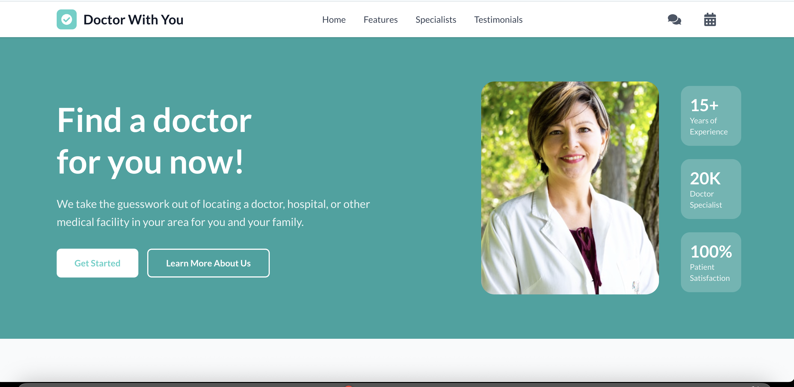

# Doctor With You - Medical Appointment Booking Platform

A modern, responsive healthcare platform that connects patients with medical professionals through an intuitive appointment booking system.

## 🌐 Live Demo

**Deployed on Vercel:** https://doctor-apt-booking-site-vc8i.vercel.app/

## 📸 Preview

  

## ✨ Features

### 🏥 Core Functionality

- **Doctor Profiles**: Browse detailed profiles of medical specialists with ratings, specialties, and bio information
- **Smart Appointment Booking**: Intuitive date and time selection with conflict detection
- **Real-time Messaging**: Direct communication system between patients and doctors
- **Responsive Design**: Fully optimized for desktop, tablet, and mobile devices

### 🎨 User Experience

- **Modern UI/UX**: Clean, professional design with smooth animations
- **Interactive Notifications**: Real-time toast notifications for user feedback
- **Mobile-First Design**: Seamless experience across all device sizes
- **Accessibility**: Built with accessibility best practices

### 🔧 Technical Features

- **Component Architecture**: Well-organized, reusable React components
- **TypeScript**: Full type safety throughout the application
- **State Management**: Custom hooks for centralized state management
- **Animation**: Smooth Framer Motion animations for enhanced user experience

## 🛠️ Tech Stack

- **Framework**: Next.js 15.3.2
- **Language**: TypeScript
- **Styling**: Tailwind CSS
- **Animations**: Framer Motion
- **Icons**: React Icons
- **Font**: Lato (Google Fonts)
- **Deployment**: Vercel

## 🚀 Getting Started

### Prerequisites

- Node.js 18.0 or later
- npm or yarn package manager


## 📱 Application Structure

```
app/
├── components/           # Reusable UI components
│   ├── Navigation.tsx    # Header and navigation
│   ├── HeroSection.tsx   # Landing section
│   ├── FeaturesSection.tsx
│   ├── SpecialistsSection.tsx
│   ├── AppointmentModal.tsx
│   ├── MessageModal.tsx
│   └── ...
├── hooks/               # Custom React hooks
│   └── useAppState.ts   # Centralized state management
├── types/               # TypeScript type definitions
│   └── index.ts
└── page.tsx            # Main application component
```

## 🎯 Key Components

### State Management

- **useAppState Hook**: Centralized state management for doctors, appointments, messages, and UI state
- **Custom Hooks**: Reusable logic for form handling and data management

### UI Components

- **Responsive Navigation**: Mobile-friendly header with dropdown notifications
- **Interactive Modals**: Appointment booking and messaging interfaces
- **Animated Sections**: Smooth page transitions and hover effects

## 📸 Screenshots

_Add screenshots of your application here_


